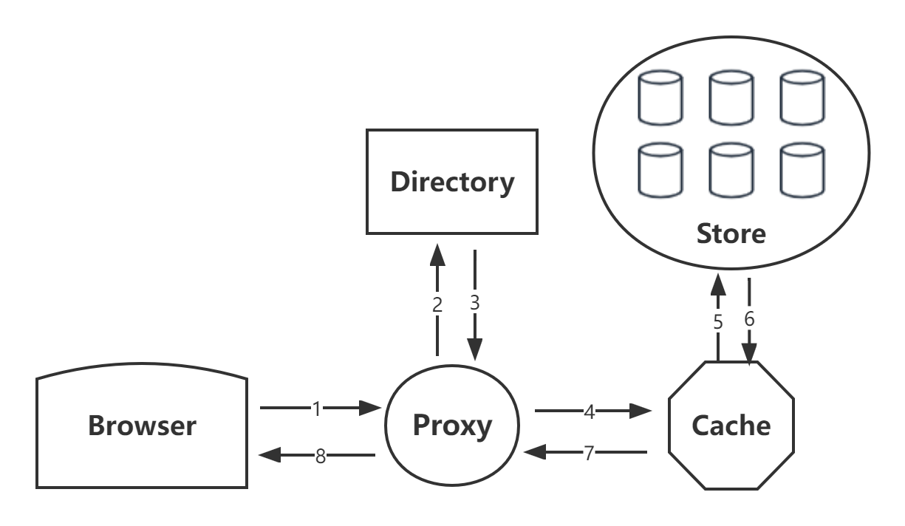

# kitten🐱

## What is kitten
Kitten is a distributed file system optimized for small files storage，core concepts based on [Facebook‘s Haystack](https://www.usenix.org/legacy/event/osdi10/tech/full_papers/Beaver.pdf)，
learned many memory optimization from [bfs](https://github.com/Terry-Mao/bfs)。（It's just a toy project, never verified in production environment）

## Features

## Quick Start

## Introduction
When the traditional file system stores a large number of small files, there will be an IO bottleneck of metadata, because each time you read a file,
you need to do IO first to find the metadata, and then find the real file through the metadata.And the data such as permission and access time stored in metadata may be useless.
In the case of a large number of small files, the metadata size corresponding to the data you save may be similar to your data size, resulting in a lot of space waste.

Kitten optimized this phenomenon in two directions：
1. Sequential writing: because the traditional mechanical hard disk has mechanical actions such as seek and rotation, the performance of sequential writing is much greater than that of random writing, so kitten's writing is designed as sequential append.
2. Metadata：Kitten appends all small files to a large file to reduce metadata，Two concepts superblock and needle are introduced here,
   Superblock is a super block that collects small files written in sequence. Need is each small file in it. When reading, you only need to find the corresponding file through the offset and size of each need maintained in memory.

Kitten is suitable for files that：`written once`, `read often`, `never modified`, and `rarely deleted`.
Goal of Kitten：`High throughput + low delay`, `Fault-tolerant`, `Cost-effective`, `Simple`.

Kitten includes the following modules：

### Proxy

As a user oriented module, the proxy module shields various operations inside kitten and exposes three simple APIs, `get`, `post` and `delete`. Represent read, write and delete operations respectively. The proxy communicates downward through grpc.

### Directory

### Cache

### Store

## Roadmap
| Name                     | Issue                                               | Description                                                                    |
|--------------------------|-----------------------------------------------------|--------------------------------------------------------------------------------|
| Kitten's basic component | [#1](https://github.com/JackLeeHal/kitten/issues/1) | Implement basic component including `Store`, `Cache`, `Directory`              |
| Introduce Etcd           | [#2](https://github.com/JackLeeHal/kitten/issues/2) | Introduce Etcd for distributed management.                                     |
| Expose easy APIs         | [#3](https://github.com/JackLeeHal/kitten/issues/3) | Find an elegantly way to expose APIs.                                          |
| Support S3 API           | [#4](https://github.com/JackLeeHal/kitten/issues/4) | As S3 APIs are the de facto standards for OSS， support S3 style APIs. |
| Implement erasure code   | [#5](https://github.com/JackLeeHal/kitten/issues/5) | Split data into two groups(hot/warm), use erasure code to store warm data.     |
