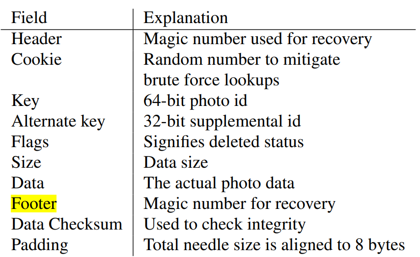

# kitten🐱

[](https://github.com/JackLeeHal/kitten/actions/workflows/go.yml)

## What is kitten
Kitten 是一个为大规模小文件存储而生的分布式文件系统，核心架构参考了[Facebook的Haystack](https://www.usenix.org/legacy/event/osdi10/tech/full_papers/Beaver.pdf)。 （本项目只是一个学习项目，未经过生产环境验证）

## Features

## Quick Start

## Introduction
传统文件系统在存储大量小文件的情况下，会出现元数据的IO瓶颈，因为每次读取一个文件需要先做一次IO找到元数据，再通过元数据找到真正的文件。并且元数据中存储的像permission、访问时间等数据可能是无用的。

在小文件数量很大的情况下你存一个数据对应的元数据大小可能跟你的数据大小差不多，这样就造成了大量的空间浪费。

Kitten从两个方向优化了这个现象：
1. 顺序写：传统的机械硬盘由于有寻道和旋转这样的机械动作，顺序写入的性能是远大于随机写入的，所以Kitten的写入设计为顺序append。
2. 元数据方面：Kitten将所有小文件append到一个大文件里，这里引入两个概念Superblock和Needle，
Superblock就是一个超大块，集合了顺序写入的小文件，Needle就是其中的每个小文件，读取时只需要通过内存里面维护的每个Needle的offset和size就能找到对应的文件。

Kitten适合的文件特点是：`一次写入`，`从不更新`，`不定期会读`，`极少删除`.

Kitten的设计目标是：`高吞吐+低延时`，`有容错机制`，`低成本`，`架构简单`.

围绕这些目标，Kitten包含了以下几个模块：


### Store

Store 作为整个系统最核心的模块，一个 `store` 由多个 `Superblock`组成，一个 `Superblock` 由多个 `Needle` 组成。




为了更快的读到所需的数据，每个Store还会维护一个内存中的数据结构，Key是Needle的Key，value则是这个Needle的offset和size。这样只需要持有一个block的fd就能找到里面的所有数据。

Store模块的pb表述如下：

```
service Store {
  rpc GetFile(GetFileRequest) returns (GetFileResponse) {}
  rpc UploadFile(UploadFileRequest) returns (UploadFileResponse) {}
  rpc DeleteFile(DeleteFileRequest) returns (DeleteFileResponse) {}
}
```

下面详细描述三种操作

#### 文件读取

Store读取文件时接收到的参数有三个：vid， key， cookie（防止猜出文件地址URL的拼接方式的暴力攻击）。


vid代表Volume的id，Store首先通过vid找到对应的Superblock。然后再通过key找到对应Needle的offset和size。这样只需要一次ReadAt就能拿到数据。

#### 文件写入

文件写入的时候只是比读取时多了一个文件真正的数据这个参数。Store会写入一个Superblock然后更新内存中的map（注意写入是append-only的）。在做更新操作的时候，由于是顺序写入，所以需要更新内存中的map保证老的Needle不会被读取到。

#### 文件删除

文件删除只需要将Needle中的Flag设置为删除即可。请求已经删除的文件会返回一个错误。已删除的文件会暂时占用储存空间，后面会详细介绍怎么处理这种孤儿Needle。


### Proxy

Proxy模块作为一个面向用户的模块，屏蔽了Kitten内部的各种操作，向外暴露三个简单的API，`get`、`post`和`delete`。分别代表读取、写入和删除操作。Proxy向下都是通过grpc进行通信。

### Directory

### Cache

## Roadmap
| Name                     | Issue                                               | Description                                                                    |
|--------------------------|-----------------------------------------------------|--------------------------------------------------------------------------------|
| Kitten's basic component | [#1](https://github.com/JackLeeHal/kitten/issues/1) | Implement basic component including `Store`, `Cache`, `Directory`              |
| Introduce Etcd           | [#2](https://github.com/JackLeeHal/kitten/issues/2) | Introduce Etcd for distributed management.                                     |
| Expose easy APIs         | [#3](https://github.com/JackLeeHal/kitten/issues/3) | Find an elegantly way to expose APIs.                                          |
| Support S3 API           | [#4](https://github.com/JackLeeHal/kitten/issues/4) | As S3 APIs are the de facto standards for OSS， support S3 style APIs. |
| Implement erasure code   | [#5](https://github.com/JackLeeHal/kitten/issues/5) | Split data into two groups(hot/warm), use erasure code to store warm data.     |
