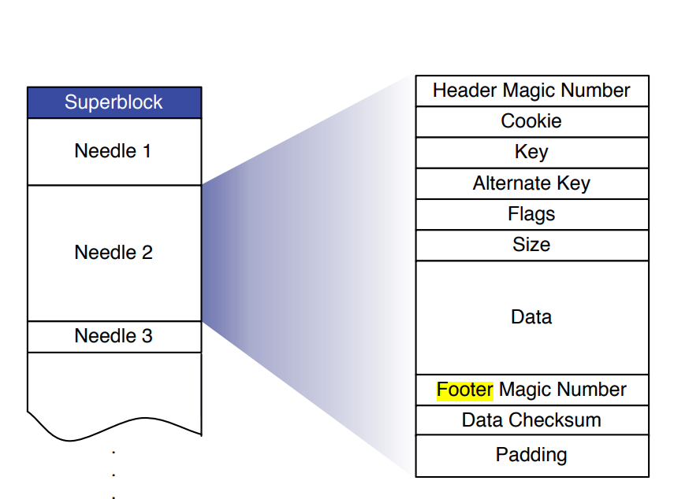

# Kitten Design Documentation

## 1. Introduction

传统的文件系统给每个文件和每个目录都生成metadata，这些metadata可能很复杂，包含一些permissions，访问时间修改时间，用户信息等等.访问一个文件就要先去磁盘上查metadata,然后才能知道文件在哪儿，再去找文件。
在海量小文件查询的场景下，metadata lookup就成了瓶颈。 一个比较极端的例子：假如每个文件 1K ，每个文件对应元数据也 1K，这样用户每存储1PB文件，对应的元数据就是1PB.
当然，设计的好坏是针对不同的应用场景而定的。比如每个文件是1GB，对应元数据为1K，这样的开销成本就是合理的。

所以在小文件的场景下，元数据的成本消耗是一个比较常见地优化方向。除此之外，既然文件多，那么我们就合并，这里引入一个概念叫Superblock（超级块），把海量的小文件合并成一个大文件。
Kitten适合的文件特点是：`一次写入`，`从不更新`，`不定期会读`，`极少删除`. 在这些特征下我们将文件的写入设计成顺序写，最大程度上利用机械硬盘的性能，减少寻道和旋转的物理延迟。

组成Superblock的一个个小文件被称为Needle，这样的设计
1. 文件的inode少了（优化了读取IO）。 
2. 顺序写（优化了写入IO）。

