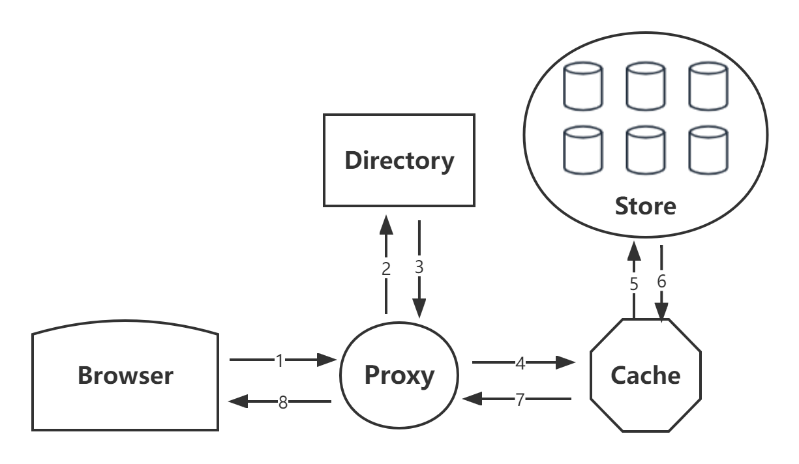

# Kitten Design Documentation

## Introduction
When the traditional file system stores a large number of small files, there will be an IO bottleneck of metadata, because each time you read a file,
you need to do IO first to find the metadata, and then find the real file through the metadata.And the data such as permission and access time stored in metadata may be useless.

In the case of a large number of small files, the metadata size corresponding to the data you save may be similar to your data size, resulting in a lot of space waste.

Kitten optimized this phenomenon in two directions：
1. Sequential writing: because the traditional mechanical hard disk has mechanical actions such as seek and rotation, the performance of sequential writing is much greater than that of random writing, so kitten's writing is designed as sequential append.
2. Metadata：Kitten appends all small files to a large file to reduce metadata，Two concepts superblock and needle are introduced here,
   Superblock is a super block that collects small files written in sequence. Need is each small file in it. When reading, you only need to find the corresponding file through the offset and size of each need maintained in memory.

Kitten is suitable for files that：`written once`, `read often`, `never modified`, and `rarely deleted`.
Goal of Kitten：`High throughput + low delay`, `Fault-tolerant`, `Cost-effective`, `Simple`.

Kitten includes the following modules：


### Store

As the core module of the whole system, a `store` is composed of multiple `Superblocks` and a `Superblock` is composed of multiple `Needles`.


To read the required data faster, each store also maintains an in-memory data structure, Key is the Key of the Needle, and value is the offset and size of the Needle. This only needs to hold the fd of a block to find all the data inside.

The pb of the Store module is expressed below:

```
service Store {
  rpc GetFile(GetFileRequest) returns (GetFileResponse) {}
  rpc UploadFile(UploadFileRequest) returns (UploadFileResponse) {}
  rpc DeleteFile(DeleteFileRequest) returns (DeleteFileResponse) {}
}
```

The three operations are described in detail below

#### Read

The Store receives three parameters when it reads the file：vid， key， cookie(Prevent brute force attacks that guess how file address URLs are spliced).

vid represents the id of Volume, and store first finds the corresponding Superblock through vid. Then find the offset and size corresponding to the Needle through the key. This only takes one ReadAt to get the data.

#### Write

The parameter of the file when it is written is only one more real data of the file than when it is read. The Store writes a Superblock and then updates the in-memory map(append-only). When doing the update operation, because it is written sequentially, it is necessary to update the map in memory to ensure that the old Needle will not be read.

#### Delete

File deletion only requires setting the Flag in the Needle to delete. Requesting a file that has already been deleted returns an error. Deleted files temporarily take up storage space, and more on how to deal with orphaned Needles later.

### Proxy

As a user oriented module, the proxy module shields various operations inside kitten and exposes three simple APIs, `get`, `post` and `delete`. Represent read, write and delete operations respectively. The proxy communicates downward through grpc.

### Directory

### Cache