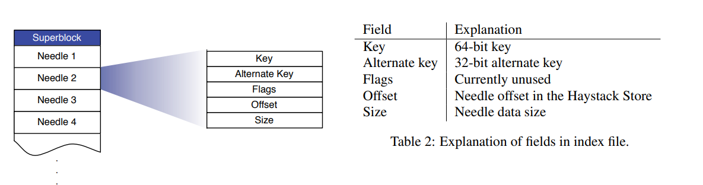

# Kitten Design Documentation


## Introduction
Facebook 公司在管理用户上传的大量图片文件时发现：传统文件系统在存储大量小文件的情况下，会出现元数据的IO瓶颈，因为每次读取一个文件需要先做一次IO找到元数据，再通过元数据找到真正的文件。

当然可以对打开的fd进行一个缓存，但是上亿文件的情况下，不可能缓存所有fd，就算使用 LRU 的策略，长尾问题还是没有解决，因为会存在 cache miss。

小文件本身的 inode 也是占用上百字节，浪费空间。

Kitten 从两个方向优化了这个现象：
1. 顺序写：传统的机械硬盘由于有寻道和旋转这样的机械动作，顺序写入的性能是远大于随机写入的，所以 Kitten 的写入设计为顺序 append。
2. 合并文件：Kitten 将所有小文件 append 到一个大文件里，这里引入两个概念 Superblock 和 Needle，
   Superblock 就是一个超大块，集合了顺序写入的小文件，Needle 就是其中的每个小文件，读取时只需要通过内存里面维护的每个 Needle 的 offset 和 size 就能找到对应的文件。

Kitten 适合的文件特点是：`一次写入`，`从不更新`，`不定期会读`，`极少删除`.

Kitten 的设计目标是：`高吞吐+低延时`，`有容错机制`，`低成本`，`架构简单`.

围绕这些目标，Kitten 包含了以下几个模块：


### Store

Store 作为整个系统最核心的模块，一个 `store` 由多个 `Superblock`组成，一个 `Superblock` 由多个 `Needle` 组成。


为了更快的读到所需的数据，每个 Store 会维护一个内存中的数据结构，Key 是 Needle 的 Key，value 则是这个 Needle 的 offset 和 size（map[needle's key]<offset, size>）。
这样只需要持有一个 block 的 fd 加上一次 ReadAt() 操作就能找到里面的所有数据。

Store模块的pb表述如下：

```
service Store {
  rpc GetFile(GetFileRequest) returns (GetFileResponse) {}
  rpc UploadFile(UploadFileRequest) returns (UploadFileResponse) {}
  rpc DeleteFile(DeleteFileRequest) returns (DeleteFileResponse) {}
}
```

下面详细描述三种操作

#### 文件读取

Store 读取文件时接收到的参数有三个：vid， key， cookie（防止猜出文件地址 URL 的拼接方式的暴力攻击）。


vid 代表 Volume 的 id，Store 首先通过 vid 找到对应的 Superblock。然后再通过 key 找到对应 Needle 的 offset 和 size。这样只需要一次 ReadAt 就能拿到数据。

#### 文件写入

文件写入的时候只是比读取时多了一个文件真正的数据这个参数。Store 会写入一个 Superblock 然后更新内存中的map（注意写入是 append-only 的）。在做更新操作的时候，由于是顺序写入，所以需要更新内存中的map保证老的Needle不会被读取到。

#### 文件删除

文件删除只需要将 Needle 中的 Flag 设置为删除即可。请求已经删除的文件会返回一个错误。已删除的文件会暂时占用储存空间，后面会详细介绍怎么处理这种孤儿Needle。

#### 索引文件

当 store 意外重启时，需要重新构造内存中的 hashmap。可以直接使用 Superblock 来还原整个内存映射，但是意味着需要扫描整个 block，这非常吃 IO。所以进行了一个加快启动过程，就是建立映射本身的索引。

索引文件写入本身是异步，用了 Golang 的 channel 来处理索引写入（批量打包一次写入），这样写入操作可以快速返回，同样删除操作并不会更新索引，而是使用 “ Lazy Read ” 的方法，读 needle 时候如果 flag 为删除，再来更新 hashmap 的内存数据。

#### 压缩（参考bitcask或者简化版的 LSM）
压缩操作能回收已删除、重复的 needle 所占据的空间。方式是逐个复制 needle 到一个新的卷文件，并跳过任何重复项、已删除项。在压缩时如果接收到删除操作，两个卷文件都需处理（代码里面会根据 compact 状态，对删除操作进行记录）。一旦复制过程执行到卷文件末尾，所有对此卷的修改操作将被阻塞，新卷文件和新内存中映射将对前任执行原子替换（COW），随后恢复正常工作。

#### 故障恢复
store 可能会因为 N 多原因导致出错，这时候 pitchfork 模块会检查出来，更新 Etcd 的状态为只读（为了运维方便，这个机器所涉及到的所有 volume 都会只读）之后再人工确认问题，一旦确诊，可以快速修复，并且更新状态，如果是数据错误，修复失败以后，可能更严厉的一步就是强制 sync，从其他节点完整的复制整个 block 进行还原，目前这个成本还是很高

#### 其他一些性能优化的手段

1. 关于维护在内存中的 map[needle's key]<offset, size> 这个数据结构，由于需要维护海量的映射，这里将其 value 的两个值合并成了一个值，使用一个 int64 的高32位表示offset，低32位表示size
2. 将存储的文件按照8字节对齐，这样一个 int32能寻址到 16GB 的数据

### Proxy

Proxy 模块作为一个面向用户的模块，屏蔽了 Kitten 内部的各种操作，向外暴露三个简单的API，`get`、`post`和`delete`。分别代表读取、写入和删除操作。Proxy向下都是通过grpc进行通信。

### Directory

Directory 这个模块负责决定请求应该被路由到哪一个 Store server、生成一个文件的唯一ID以及监听 etcd 中 store、volume 的变化。

### Cache
